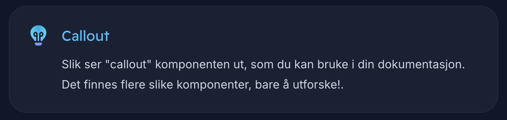

# Codex

Velkommen til **Codex**, TIHLDE INDEX sin dokumentasjonsnettside.
Her finner du informasjon om alle prosjektene våres, tech stacks, viktige programmeringskonsepter, møtereferater og miljøvariabler.


-----

## Intro

Dette prosjektet er bygget med [Nextjs](https://nextjs.org/), et React server-side rammeverk og
[Markdoc](https://markdoc.dev/), en markdown dokumentasjonsmalingsmotor.
Prosjektet er hostet på [Vercel](https://vercel.com/), skaperne av Nextjs.

Grunnen til at vi bruker Markdoc er for å kunne skrive dokumentasjon i markdown og ha det
rendret som et statisk nettsted, samtidig som vi kan bruke React-komponenter i markdown-filene.
Dette lar oss skrive dokumenter raskt, tilpasse nettstedet, forhåndsvise komponenter og
innebygde lenker.

Utover det følger alle markdown-filer vanlig Markdown-syntaks. Vennligst konsulter
[Markdoc-dokumentasjonen](https://markdoc.dev/docs) for mer informasjon.

## Prosjektstruktur

Følgende seksjon dekker prosjekt/fil-strukturen og hva som ligger hvor.

### Dokumentasjonsfiler

Hvis du kun planlegger å skrive dokumentasjon, kan du åpne mappen `src/app/docs` og
begynne å skrive markdown `page.md`-filer. Følg eksempelvis hvordan andre sider er skrevet.

Vi har et navigasjonstre på venstresiden av skjermen. Denne oppdateres ved å referere til markdown-filen din i `app/lib/navigation.ts`. Pass på at dokumentasjonen din følger samme struktur som dette treet, slik at det blir lettere å holde styr på filene.

### Komponenter

Dette er React-komponentene som brukes i markdown-filene og ellers i nettsiden, og ligger i `src/components`-mappen.

Her finner du 4 mapper:
1. documentation - Komponenter som brukes i selve dokumentasjonen
2. events - Komponenter for arrangementsystemet
3. forms - Komponenter for skjema-utfylling
4. minutes - Komponenter for interne dokumenter som møtereferater og miljøvariabler
5. ui - Generelle komponenter som knapper og logo, som brukes overalt

### Markdoc

I mappen `src/app/markdoc` ligger alt av nodes og tags som brukes for å manipulere markdown-filene. Noder brukes for å "style" markdownen, som for eksempel kodeblokker:

```javascript
console.log('Jeg er en kodeblokk!');
```

Tagger derimot lar oss bygge egne komponenter som "Callout" komponenten. Slik ser denne ut:


Denne brukes ved å skrive:
```

  Slik ser "callout" komponenten ut ...

```

Du finner hva slags "props" tags tar imot ved å gå inn på `arc/markdoc/tags.js`. Sjekk ut [Markdoc-dokumentasjonen](https://markdoc.dev/docs/tags) for mer informasjon om hvordan egne komponenter brukes i dokumentasjonen.

## Markdown-side

Hver markdown-fil har en metadataseksjon på toppen, som brukes til å generere siden. Denne
delen er skrevet i YAML, og blir tolket av Markdoc-motoren. Bruk alltid `title` feltet, slik at
vi får generert en tittel til siden din.
_Eksempel_

```yaml
---
title: Min dokumentasjonsside
---
```

## Quiz

For å lage en quiz, bruk følgende komponent:
```

```

Merk at spørsmåls-lista må være gyldig !**JSON**! for at det skal funke! Dvs alle felter må wrappes i double quotes.
Det anbefales å skrive spørsmålene f.eks. i vs code på følgende vis:

1. Åpne en ny fane med `ctrl + T`
2. Velg språk med `ctrl + K`, `M`
3. Skriv "JSON" og trykk enter

## Dokumenter-siden

Denne siden ("minutes" på engelsk) brukes for å legge til, endre og se interne dokumenter i INDEX/DRIFT. Siden disse dokumentene kan være sensitive, lagres all data i Lepton, og sjekker at du er med i INDEX/DRIFT for å få tilgang.

Her brukes også markdown for å skrive filene, som blir lagra i databasen.

## Env-variabler

For å kjøre prosjektet trenger du følgende environment variabler:
```
# Oppkobling til Lepton
NEXT_PUBLIC_TIHLDE_API_URL='https://api.tihlde.org'

# Variabler for autentiseringssystemet
NEXTAUTH_URL='http://localhost:3000'
NEXTAUTH_SECRET='<tilfeldig tekst>'

# bestemmer hvem som har tilgang til Codex, du kan legge til din egen gruppe for testing
NEXT_PUBLIC_ALLOWED_GROUP_SLUGS="index" 
```

## Hvordan kjøre prosjektet?

Du trenger bare å ha [Node.js](https://nodejs.org/en) og [pnpm](https://pnpm.io/) installert for å kjøre prosjektet.

Da kan du kjøre: `pnpm dev` for å kjøre prosjektet.

## Pull requests

Anders Morille (nestleder i INDEX) er hovedansvarlig for dette prosjektet, og alle pull requests går gjennom han før det publiseres. Dette er bare for å sørge for at prosjektstrukturen bevares og at alt funker som det skal.

Det var alt du trengte for å starte, god progging!
